# Sistema de gestíon escolar - CONECTA - Colegio Concepión Linares
Este es un sistema web el cual fue desarrollado como parte de la practica profesional para la carrera de Analista Programador. 

El sistema permite la gestion de permisos (Funcionarios), retiros y justificativos (Alumnos). Además, este incluye un panel completo de Administrador, exportacción de datos a PDF y un bot de WhatsApp que notifica a los inspectores a cargo cuando un apoderado realiza un retiro de un estudiante.

---
# ✨ Fucionalidades principales
- CRUD de usuarios (Administradores), áreas, alumnos, cursos e inspectores.
- Gestión de permisos, retiros y justificativos.
- Panel administrativo con gráficos para cada modulo correspondiente.
- Filtro por fechas, nombre/RUT.
- Exportación de registros a PDF.
- Mensajes automáticos por WhatsApp usando Chat-API.
---

# 🛠️ Construido con

**Backend**
- Lenguaje utilizado [Python 3.9](https://www.python.org/)
- Framework utilizado [Django](https://www.djangoproject.com/) 

**Base de datos**
- Base de datos utilizada [PostgreSQL](https://www.postgresql.org/)

**Frontend**
- HTML, CSS, JavaScript
- Para los graficos [Highcharts ](https://www.highcharts.com/) 
- Para exportación a PDF: html2canvas
---

# 🤖Mensajes de WhatsApp
El sistema incorpora un módulo de mensajes automatizados mediente WhatsApp, utilizado para notificar a los inspectores cuando un apoderado solicita el retiro de un alumno. Esto se implentó utilizando **Chat-API**

**¿Qué es Chat-API?**
Fue una solución no oficial que ofrecía una interfaz REST para interactuar con WhatsApp. Esta simulaba el comportamiento de WhatsApp Web a través del escaneo de un código QR.
>⚠️Importante: Actualmente, Chat-API esta **descontinuado** y ya no cuenta con un soporte oficial. Su funcionamiento se basaba en técnicas de ingeniería inversa, por lo que **no estaba ni esta respaldado por Meta (WhatsApp)**.

### Implementación en el sistema

- Ante una solicitud de retiro por parte de un apoderado, el sistema envía un mensaje automático mediante un numero real (por ejemplo, el numero propio) al inspector correspondiente.

- El mensaje contiene opciones predefinidas para que el inspector pueda responder fácilmente (**Confirmar retiro**, **Alumno ocupado en una actividad (Prueba, reunion, etc.)**, **Alumno no se encuentra en el establecimiento**).
    
- La respuesta del inspector es registrada en la base de datos y actualiza el estado del retiro en el sistema.

Esta integración permitió una comunicación rápida y eficiente, mejorando el tiempo de respuesta y facilitando el control de los retiros en tiempo real.

---

# ⚙️Instalación local
### 1. Clonar el repositorio

```bash
git clone https://github.com/ClaudioP/Sistema_CCL.git
cd Sistema_CCL
```

### 2. Crear y activar entorno virtual
```bash
python -m venv env # Puede ser python o py
env\Scripts\activate
```
### 3. Instalar las dependencias
```bash
pip install -r requerimientos.txt
```
También es necesario instalar las dependencias para **Chat-API**
```bash
cd ...\wsp_bot
npm install
```
### 4. Configurar la base de datos
Es necesario editar el archivo `settings.py` con los datos correctos de su base de datos PostgreSQL:

	DATABASES  = {
		    'default': {
				'ENGINE': 'django.db.backends.postgresql',
				'HOST': 'localhost',		    
				'PORT': '5432',		    
				'NAME': 'nombre_bd', # Por defecto es 'db_sistema_permisos'		    
				'USER': 'usuario',	# Por defecto es 'postgres'		    
				'PASSWORD': 'contraseña', # Por defecto es 'password'
			}  
    }
### 5. Aplicar las migraciones correspondientes
```bash
python manage.py migrate
```
### 6. Crear un superusuario
Se utiliza para acceder al Panel de Administrador.
```bash
python manage.py createsuperuser
```
### 7. Ejecutar el bot
Para inicializar el bot es necesario abrir otra terminal de VS Code
```bash
cd ...\wsp_bot
npm start
```
Escanea el codigo QR que se le proporciona y el bot comenzará a funcionar.
### 8. Ejecutar el servidor
```bash
python manage.py runserver
```

---
# 📸 Capturas del sistema

### 🟢 Inicio de sesión
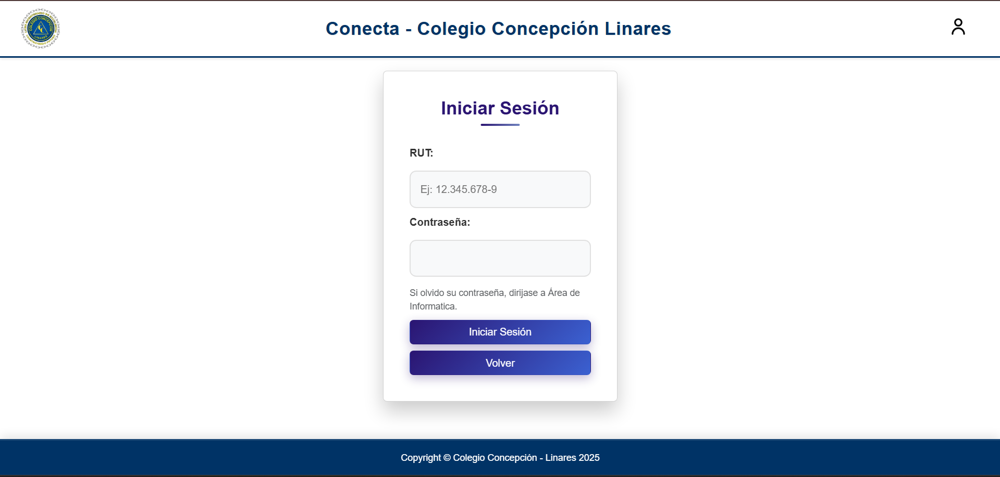

### 🟢 Panel de administrador con gráficos
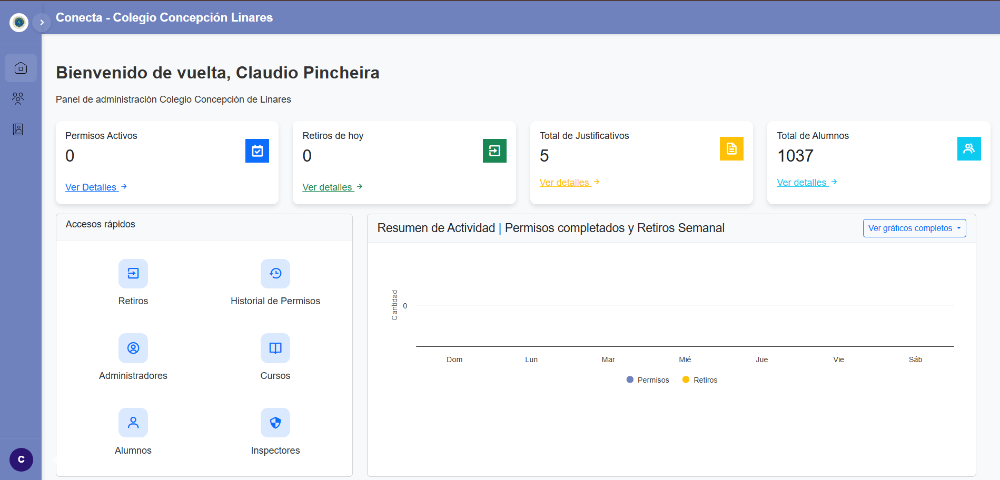

### 🟢 Listado de permisos y formulario
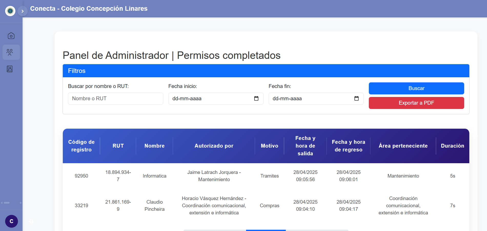
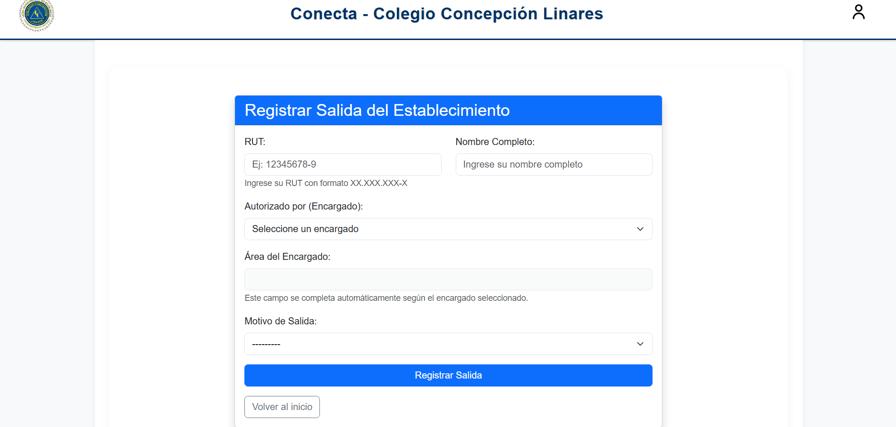

### 🟢 CRUD Administradores

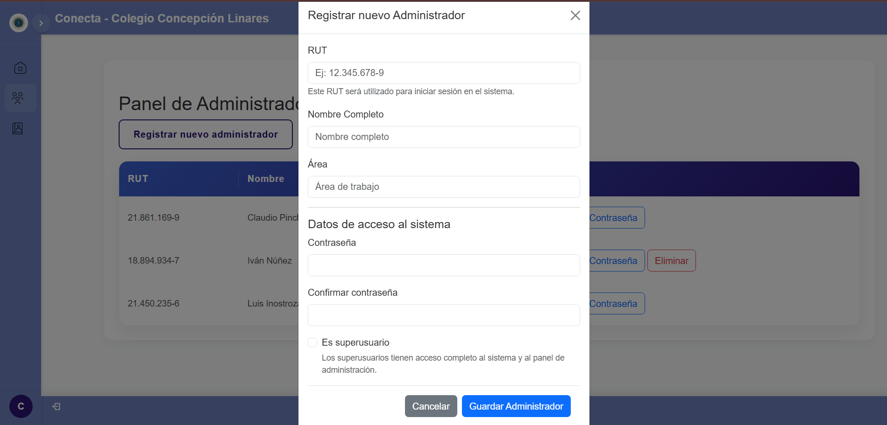
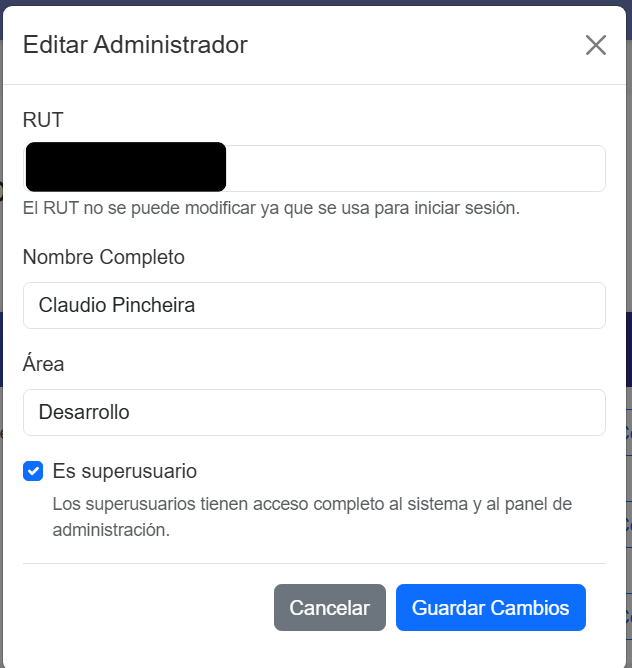
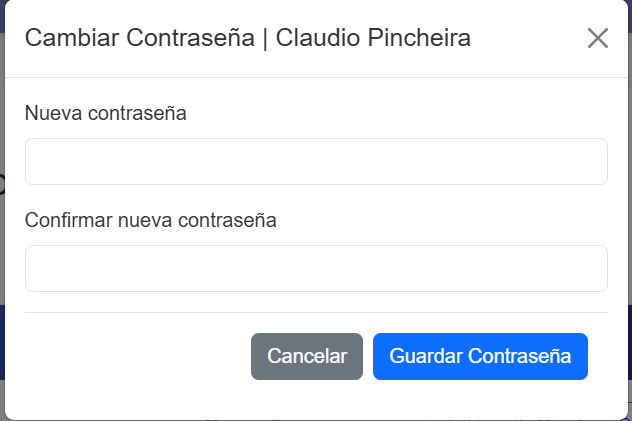

### 🟢 Listado de retiros y formulario de retiro
**RUTs censurados para evitar posibles problemas de privacidad.**


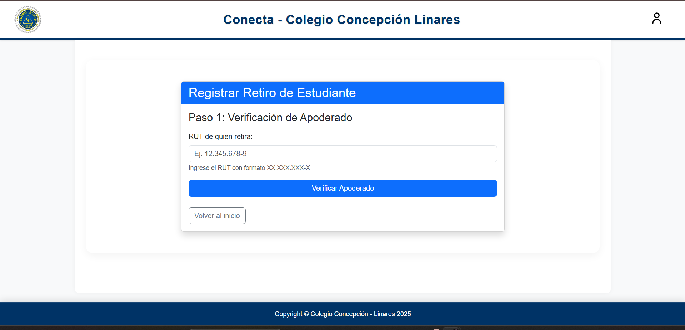
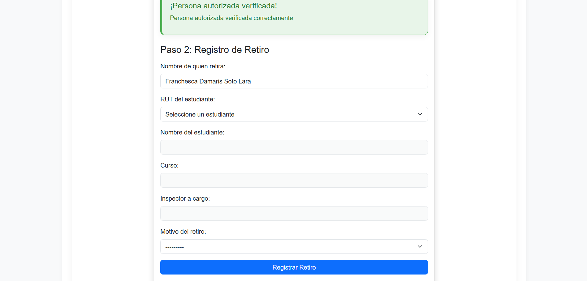

### 🟢 Mensaje automático por WhatsApp

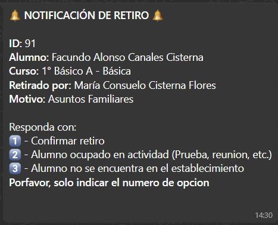

### 🟢 Exportación a PDF
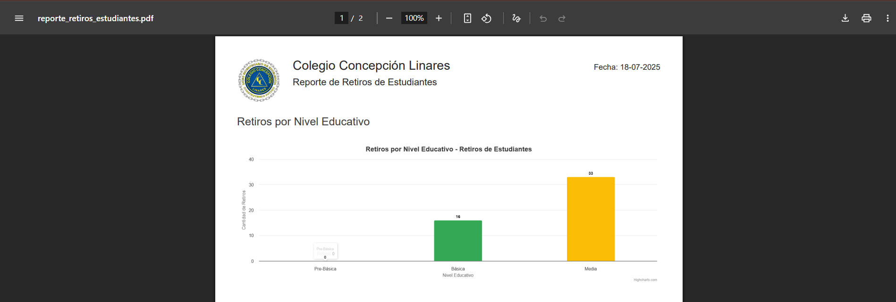
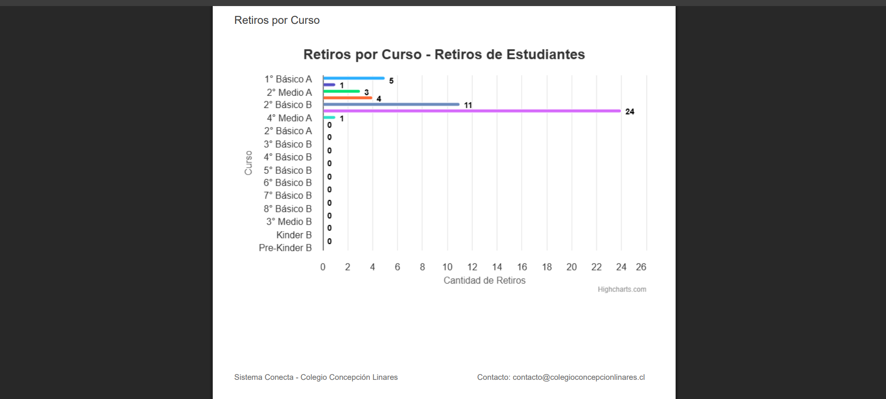
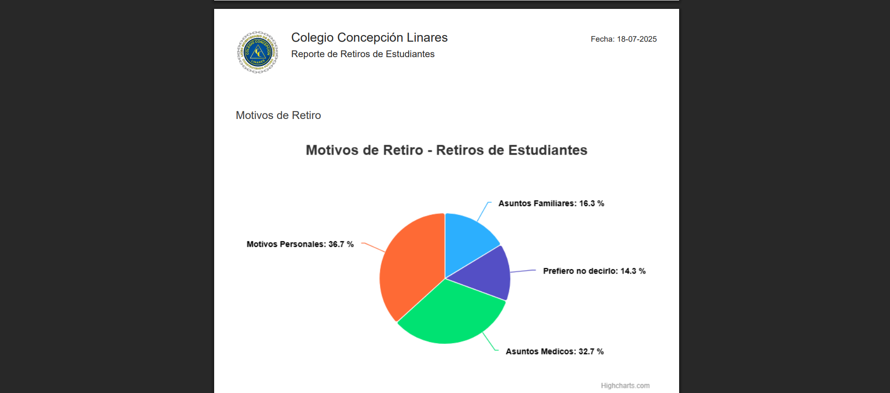

---

# ✒️ Autores

- **Claudio Pincheira Carter** – Desarrollo del módulo administrador, integración de gráficos, exportación PDF y bot de WhatsApp.  
- [**Luis Inostroza Valenzuela**](https://github.com/SrLuchohub) – Desarrollo del módulo de funcionarios y estudiantes desde la vista del usuario.  


# 📄 Licencia

Este proyecto fue desarrollado como parte de la práctica profesional de la carrera Analista Programador del instituto CFT San Agustín, Linares en el Colegio Concepción Linares.  
**El código es de uso académico y no está destinado para uso comercial.**

---
# ℹ️ Notas adicionales

- El módulo de WhatsApp requiere conexión activa y escaneo de código QR cada vez que se reinicia.
- En caso de errores con PDF, asegúrese de tener permisos de navegador adecuados (html2canvas puede fallar si se bloquea por seguridad).
- El sistema está optimizado para pantallas de escritorio (no responsivo para móviles).
